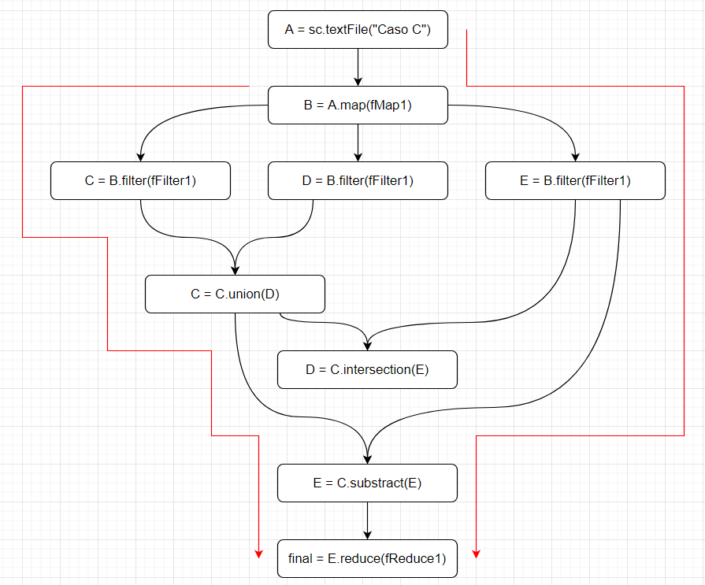
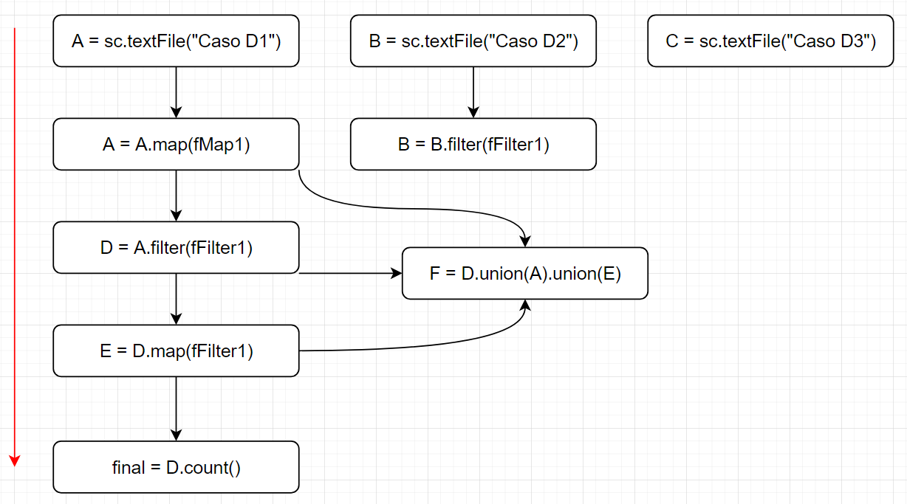

# 2. Dados los siguientes scripts en Spark, dibuje el DAG correspondiente ¿Qué se termina ejecutando?

## a.
```python
A = sc.textFile(“Caso A”)
B = A.map(fMap1)
C = B.filter(fFilter1)

final = B.reduce(fReduce1)
```

## b.

```python
A = sc.textFile(“Caso B”)
B = A.map(fMap1)
C = B.filter(fFilter1)
C = B.map(fmap2)
D = C.filter(fFilter2)

final = D.reduce(fReduce1)
```


## c.
```python
A = sc.textFile(“Caso C”)
B = A.map(fMap1)
C = B.filter(fFilter1)
D = B.filter(fFilter1)
E = B.filter(fFilter1)
C = C.union(D)
D = C.intersection(E)
E = C.substract(E)

final = E.reduce(fReduce1)
```


## d.
```python
A = sc.textFile(“Caso D1”)
B = sc.textFile(“Caso D2”)
C = sc.textFile(“Caso D3”)
A = A.map(fMap1)
B = B.filter(fFilter1)
D = A.filter(fFilter1)
E = D.map(fFilter1)
F = D.union(A).union(E)

final = D.count()
```

